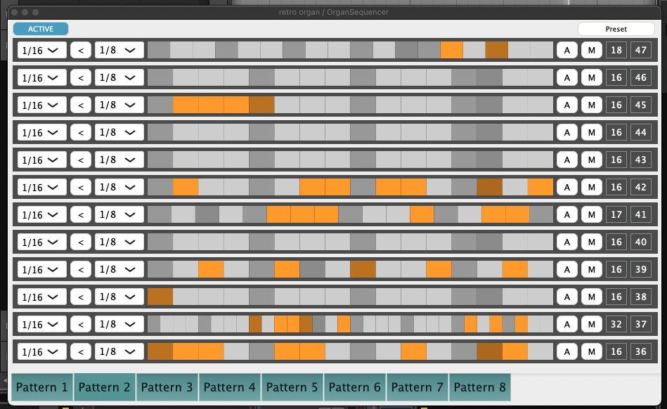

# Organ Sequencer

Organ Sequencer is a midi plugin sequencer that somewhat looks like the [EKO Computerhythm](https://www.synthtopia.com/content/2021/08/30/the-eko-computerhythm-a-rare-programmable-space-age-drum-machine/).

It is not a finished product but an experimentation on dynamic step sequencers and see what could be usefull. *THIS IS PROTOTYPE*

* It is designed to be played live so patterns can be run in parallel by triggering midi notes. Similar of what you can do with a real organ, where can mix a MAMBO with a MARCH by pressing both buttons at the same time
* Each note steps can have their own steps size, usefull for polyrhythm
* Javascript can be used to modify the content of the note steps. The plan is to have a bunch of javascripts snippets for content generation and manipulation. The Javascript API is still at the beginning
* The script can be run at a fixed number of bars so the beat can be generative and based on the original step content

It is a work in progress based on what I did originally with max4live: [gammik](https://maxforlive.com/library/device/1967/gammik) - [organseq](https://maxforlive.com/library/device/186/organseq) - [buste](https://maxforlive.com/library/device/1274/buste)